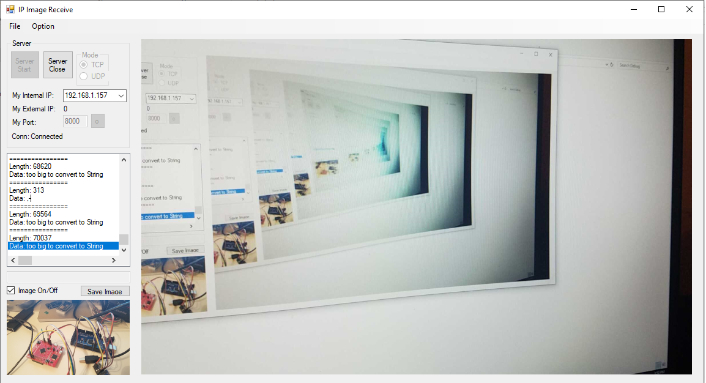

# CSharp-IP-Cam-Receiver

This application is able to work with [the project titled Android-IP-Cam-Sender](https://github.com/kkbw1/Android-IP-Cam-Sender) in my repository.  

Development IDE: Visual Studio 2010  
Language: C#  

This application can make connection using either TCP or UDP to receive data packet.  
Preview images and Captured images are viewed on different picture boxes which are positioned Center big one and left bottom smaller one.  
The captured image on the smaller picture box is able to save on drive.

